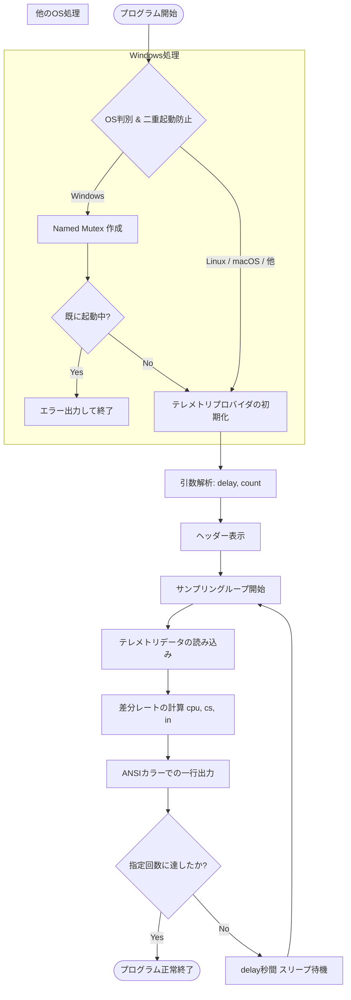
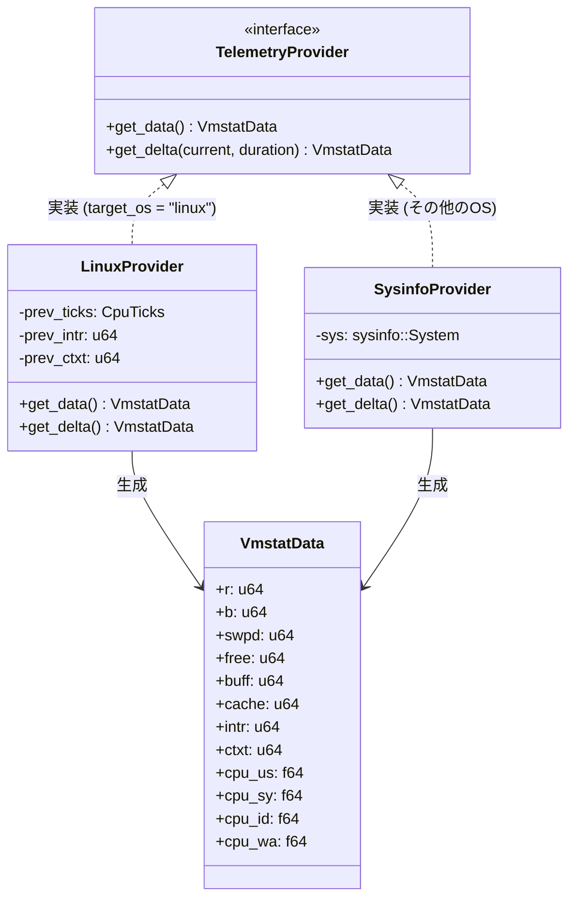
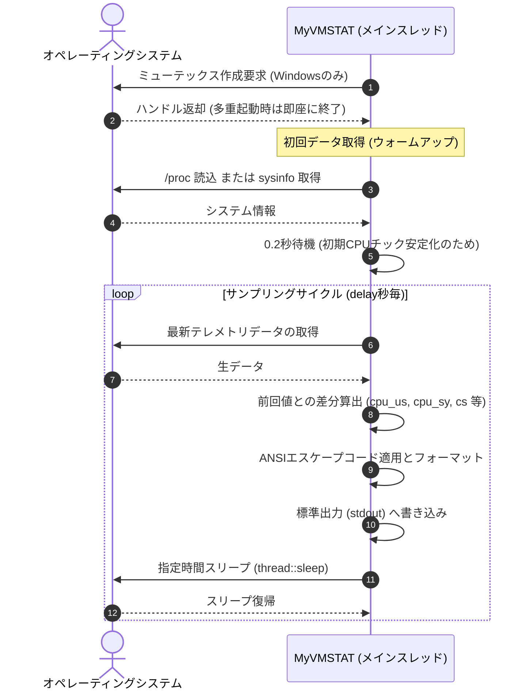

# システム構成図: MyVMSTAT

本ドキュメントは、**MyVMSTAT** の制御フロー、スレッド、およびデータ取得経路について視覚的に定義します。

---

## 1. 全体制御フロー

アプリケーションの起動から終了までの制御フロー図です。

---

## 2. データ取得構造とプラットフォーム抽象化

プログラム内部でのプラットフォーム別のデータソース抽象化を表したクラス/トレイト関連図です。

---

## 3. スレッド・待機サイクル

本ツールはメインスレッド単一で動作します。イベント駆動ではなく、周期的なブロッキング待機（`thread::sleep`）によるポーリング制御を行います。

