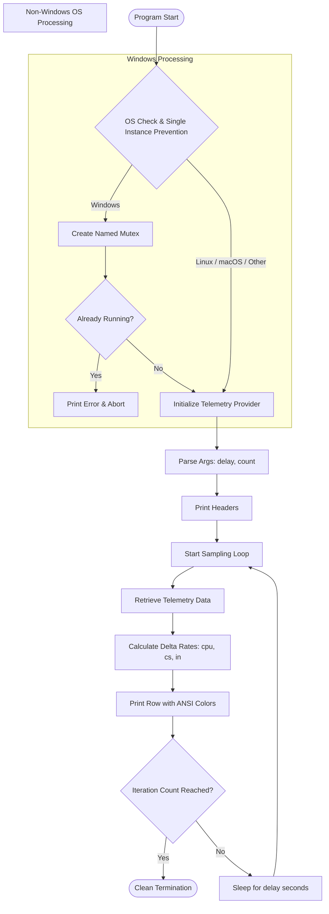
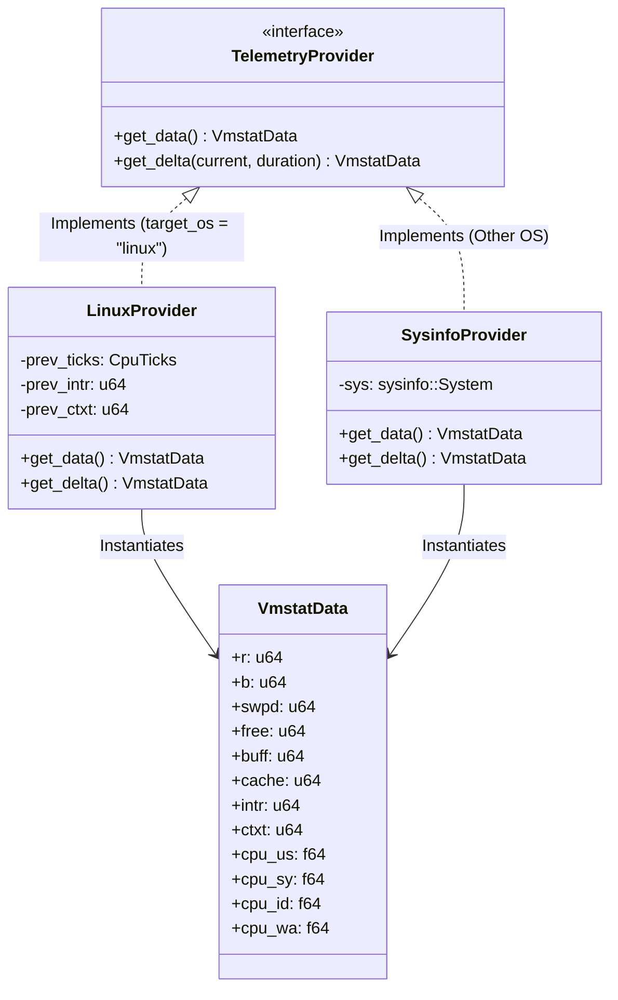
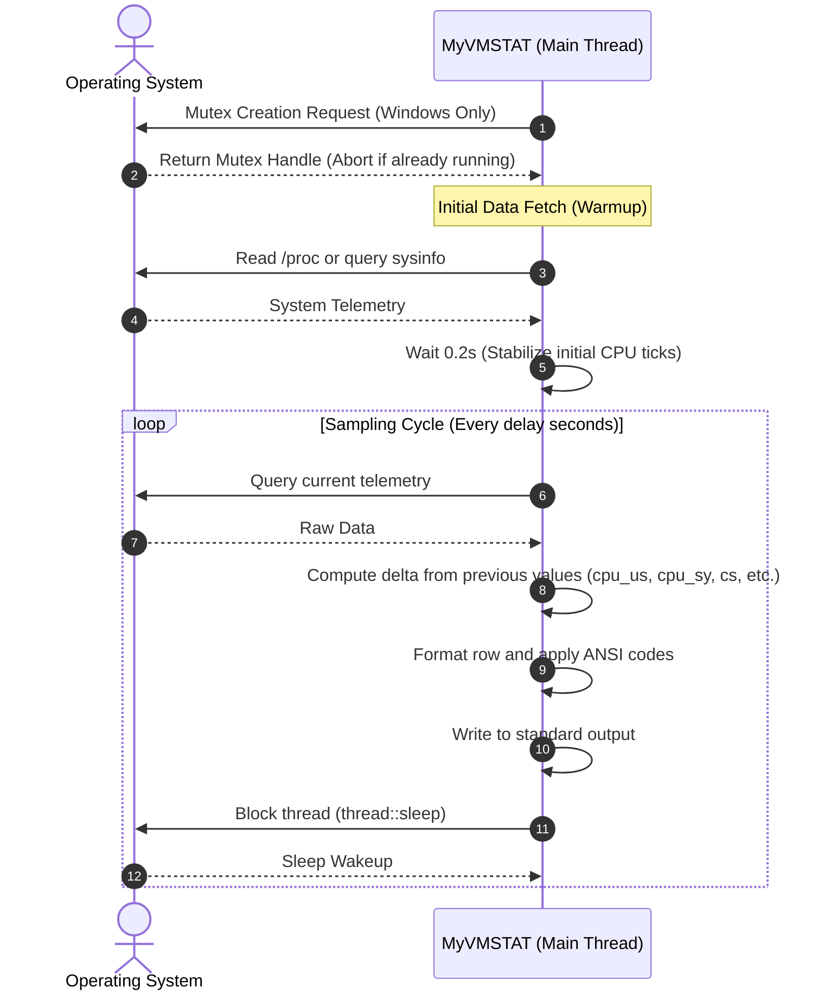

**English** | [日本語版](../ja/DIAGRAM.md)

# System Diagrams: MyVMSTAT

This document visually defines the control flow, thread lifecycle, and data retrieval paths of **MyVMSTAT**.

---

## 1. Overall Control Flow

The diagram below outlines the runtime execution flow from startup to clean exit.

---

## 2. Telemetry Retrieval Structure and Platform Abstraction

This class diagram represents how the different telemetry data sources are abstracted based on the compilation target.

---

## 3. Thread and Waiting Lifecycle

The application operates entirely on a single thread. Instead of being event-driven, it manages polling loops with periodic blocking waits using `thread::sleep`.

